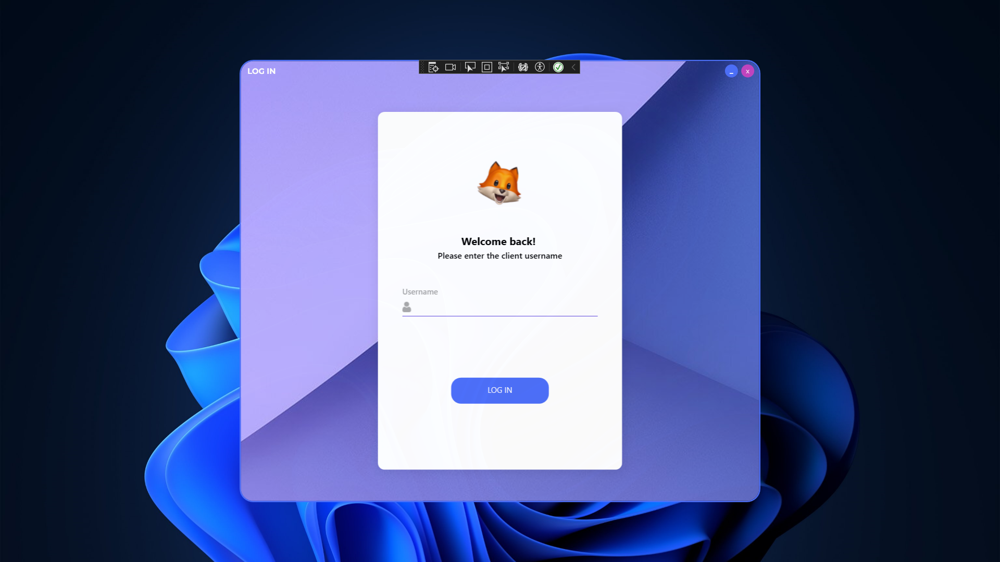

# IsClient
a desktop application developed using C# with WPF and follows the MVVM (Model-View-ViewModel) pattern. It provides a simple login functionality for checking the login of a client.


## Screenshots




## Getting Started

1. Clone the repository:

   ```bash
   git clone https://github.com/your-username/your-repository.git
   ```

2. Build and run the solution using Visual Studio or your preferred IDE.
3.Explore the application.


